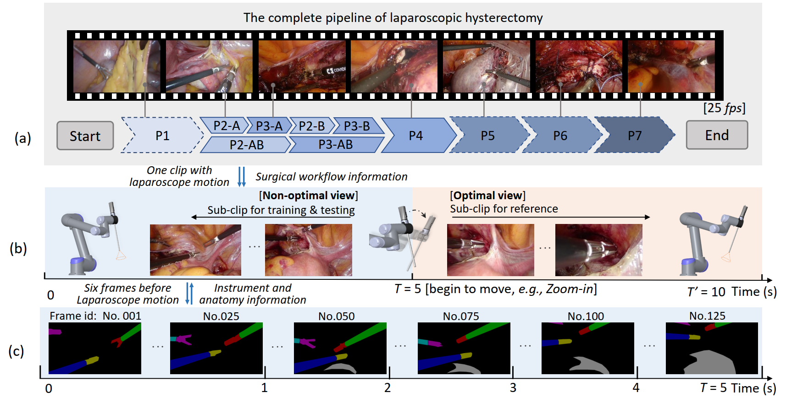

# AutoLaparo

## Introduction

This repository contains code and benchmarks proposed in AutoLaparo dataset. 

Paper: [AutoLaparo: A New Dataset of Integrated Multi-tasks for Image-guided Surgical Automation in Laparoscopic Hysterectomy](https://arxiv.org/abs/2208.02049)

Dataset available: <https://autolaparo.github.io>

<p align="center">

</p>

## Abstract
> Computer-assisted minimally invasive surgery has great potential in benefiting modern operating theatres.
The video data streamed from the endoscope provides rich information to support context-awareness for next-generation intelligent surgical systems.
To achieve accurate perception and automatic manipulation during the procedure, learning based technique is a promising way, which enables advanced image analysis and scene understanding in recent years.
However, learning such models highly relies on large-scale, high-quality, and multi-task labelled data. This is currently a bottleneck for the topic, as available public dataset is still extremely limited in the field of CAI.
In this paper, we present and release the first integrated dataset (named AutoLaparo) with multiple image-based perception tasks to facilitate learning-based automation in hysterectomy surgery. 
Our AutoLaparo dataset is developed based on full-length videos of entire hysterectomy procedures. 
Specifically, three different yet highly correlated tasks are formulated in the dataset, including surgical workflow recognition, laparoscope motion prediction, and instrument and key anatomy segmentation. 
In addition, we provide experimental results with state-of-the-art models as reference benchmarks for further model developments and evaluations on this dataset. 

## Benchmarks

### Task 1 Surgical workflow recognition  

Run ```python t1_video2frame.py``` for data processing.

The original surgical videos are converted to frames and downsampled from 25 fps to 1 fps.  
The images are resized from 1920 x 1080 to 250 x 250. We also cut the black margin existed in the frame.

Reference benchmarks:

| **No.** | **Name** | **Pub.** | **Year** | **Title** | **Links** |  
|:---: | :---: | :---: | :---: | :---  | :---:|  
| 01 |  SV-RCNet    |  TMI     | 2017 | SV-RCNet: Workflow Recognition From Surgical Videos Using Recurrent Convolutional Network |[Paper](https://ieeexplore.ieee.org/abstract/document/8240734)/[Code](https://github.com/YuemingJin/SV-RCNet)|  
| 02 |  TMRNet      |  TMI     | 2021 | Temporal Memory Relation Network for Workflow Recognition From Surgical Video | [Paper](https://ieeexplore.ieee.org/abstract/document/9389566)/[Code](https://github.com/YuemingJin/TMRNet)|   
| 03 |  TeCNO       |  MICCAI  | 2020 | TeCNO: Surgical Phase Recognition with Multi-stage Temporal Convolutional Networks | [Paper](https://link.springer.com/chapter/10.1007/978-3-030-59716-0_33)/[Code](https://github.com/tobiascz/TeCNO)|   
| 04 |  Trans-SVNet |  MICCAI  | 2021 | Trans-SVNet: Accurate Phase Recognition from Surgical Videos via Hybrid Embedding Aggregation Transformer | [Paper](https://link.springer.com/chapter/10.1007/978-3-030-87202-1_57)/[Code](https://github.com/xjgaocs/Trans-SVNet)|   


### Task 2 Laparoscope motion prediction

Run ```python t2_datapre.py``` for data processing and dataset splitting. 
Each clip is converted to frames and resized to 250 x 250. In our implementation, it is downsampled to 3 fps. 


### Task 3 Instrument and key anatomy segmentation

Reference benchmarks:

| **No.** | **Name** | **Pub.** | **Year** | **Title** | **Links** |  
|:---: | :---: | :---: | :---: | :---  | :---:|  
| 01 |  Mask R-CNN  |  ICCV | 2017 | Mask R-CNN |[Paper](https://openaccess.thecvf.com/content_ICCV_2017/papers/He_Mask_R-CNN_ICCV_2017_paper.pdf)/[Code](https://github.com/matterport/Mask_RCNN)|  
| 02 |  YOLACT      |  ICCV | 2019 | YOLACT: Real-time Instance Segmentation | [Paper](https://openaccess.thecvf.com/content_ICCV_2019/papers/Bolya_YOLACT_Real-Time_Instance_Segmentation_ICCV_2019_paper.pdf)/[Code](https://github.com/dbolya/yolact)|   
| 03 |  YolactEdge  |  ICRA | 2021 | YolactEdge: Real-time Instance Segmentation on the Edge | [Paper](https://ieeexplore.ieee.org/abstract/document/9561858)/[Code](https://github.com/haotian-liu/yolact_edge)|   


## Citation

If you use the dataset, code or benchmark results for your research, please cite:

```
@article{wang2022autolaparo,
  title={AutoLaparo: A New Dataset of Integrated Multi-tasks for Image-guided Surgical Automation in Laparoscopic Hysterectomy},
  author={Wang, Ziyi and Lu, Bo and Long, Yonghao and Zhong, Fangxun and Cheung, Tak-Hong and Dou, Qi and Liu, Yunhui},
  journal={arXiv preprint arXiv:2208.02049},
  year={2022}
}
```

### Questions

For further questions, please contact 'ziyiwangx@gmail.com'
